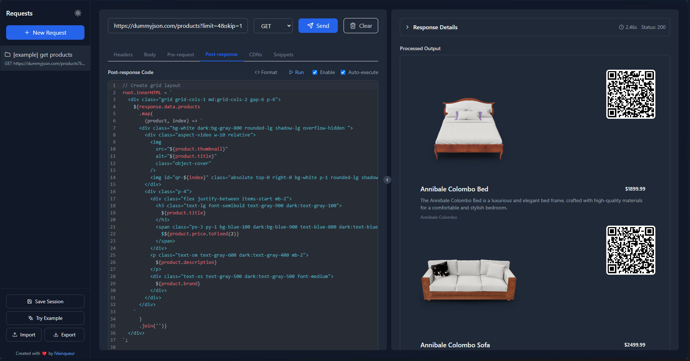

# Simple API Client

🚀 A lightning-fast API testing client that supercharges your development workflow. Stop switching between tools and writing boilerplate code - get everything you need in one place.


*Transform API responses into beautiful UIs with just a few lines of code*

## ⚡ Why Choose Simple API Client?

### Instant Productivity
- **Try Example Button**: Get started in seconds with pre-built examples showcasing beautiful UI transformations
- **Quick Import/Export**: Share your API collections with teammates or backup your work with one click
- **Smart Defaults**: Common headers and configurations ready to go

### Powerful Transformations
- **Live Code Execution**: Write and run JavaScript directly in the client
  - Pre-request scripts to modify requests
  - Post-response scripts to transform and visualize data
- **Dynamic CDN Integration**: Add any npm package or library on the fly
  - No need to install dependencies
  - Access thousands of libraries instantly
  - Perfect for quick prototypes and experiments

### Beautiful Visualizations
- Transform API responses into stunning UIs with built-in DOM manipulation
- Create interactive dashboards and data visualizations
- Preview HTML responses in real-time

### Time-Saving Features
- **Session Management**: Never lose your work
  - Auto-save all requests
  - Import/export entire sessions
  - Share configurations with your team
- **Code Snippets**: Save and reuse common transformations
- **Smart Formatting**: Automatic code and JSON formatting
- **Dark/Light Theme**: Easy on the eyes, day or night

## 🚀 Quick Start

1. Clone and install:
```bash
pnpm install
pnpm start
```

2. Click "Try Example" to see it in action!

## 💡 Perfect For
- **API Development**: Test and debug your endpoints in real-time
- **Prototyping**: Transform APIs into working UIs in minutes
- **Data Visualization**: Create beautiful representations of your data
- **Team Collaboration**: Share your API configurations effortlessly
- **Learning & Exploration**: Experiment with APIs and transformations

## 🎯 Key Differentiators
- **Code Execution Environment**: Run JavaScript directly in the client
- **Dynamic CDN Loading**: Add any library on the fly
- **DOM Manipulation**: Transform responses into rich UIs
- **Real-time Preview**: See your changes instantly
- **Zero Config**: Start testing APIs immediately

## 🌟 Support the Project

If you find Simple API Client useful, consider:

- **⭐ Star the Project**: Your star on [GitHub](https://github.com/IVainqueur/simple-api-client) helps others discover the project
- **☕ Buy Me a Coffee**: Support development with a [small donation](https://www.buymeacoffee.com/ivainqueur)

Your support helps keep this project active and growing!

## Contributing

Love Simple API Client? Contributions are welcome! Feel free to submit a Pull Request. 